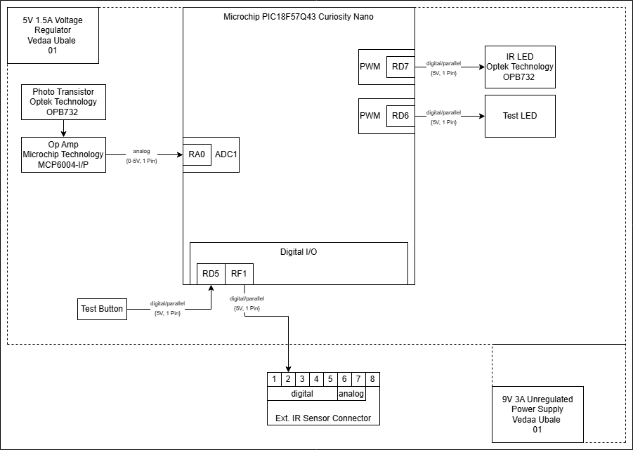

## Overview
This block diagram uses an IR LED and phototransistor to create an IR sensor that measures the fill level of the trash can. When the IR sensor detects that the trash has reached a certain height, it sends an output signal to the External IR Sensor and UI Lights subsystem through the communication connector. This signal triggers the red LED to notify the user that the trash is full and needs to be emptied.

The subsystem relies on the Curiosity Nano to process the sensor input and communicate with the indicator subsystem. The power source for this subsystem is a 9V wall-connected supply through a barrel jack or a 9V/5V transfer from another subsystem via the communication connectors.

## Internal IR Sensor Trash Height Subsystem Block Diagram
Vedaa Ubale's Trash Height Subsystem (Internal IR Sensor)

