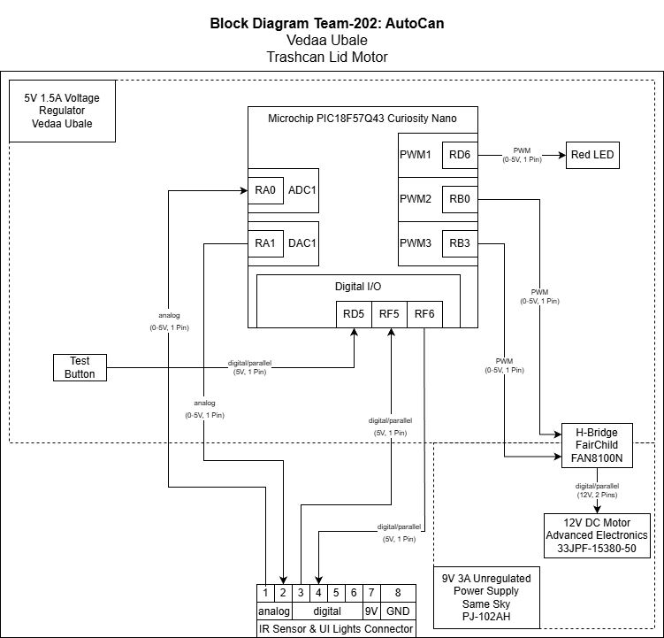

## Overview
This subsystem automatically opens and closes the trash-can lid using a DC motor controlled by the Curiosity Nano microcontroller. The Nano receives input signals from the IR Sensor & UI Lights connector and the onboard test button, then determines when the lid should move. It sends control signals to an H-Bridge, which powers the motor and allows the lid to open or close as needed. A red LED provides simple status feedback to the user.

The subsystem is powered by a 9V supply, with a 5V regulator providing the logic voltage required by the Curiosity Nano and its connected inputs and outputs. Communication between this subsystem and the external IR sensor and IU lights subsystem is handled through the shared connector.

## Lid Motor Subsystem Block Diagram
Vedaa Ubale's Lid Motor Subsystem 

## Diagram Link
A direct link to the source file of the block diagram can be found [here](finalbdvedaa.drawio)
