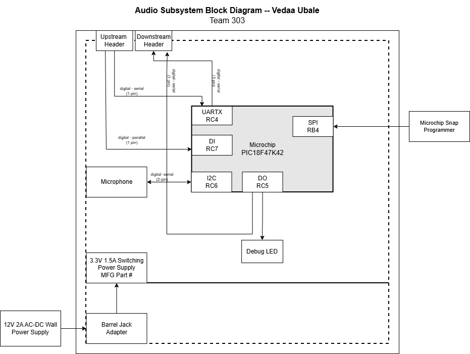

## Overview
This block diagram shows the main parts of the Microphone Subsystem and how they connect to the rest of the robot. It includes the power source and voltage regulator that step 12 V down to 3.3 V for the electronics, the microphone that captures sound from the environment, and the microcontroller that processes the audio data. The diagram also shows the debug LED used for testing and the communication headers that link this subsystem to other team modules. These connections allow the microphone data to be shared with the main system while keeping the subsystem powered and controlled properly.

## Audio Subsystem Block Diagram 

