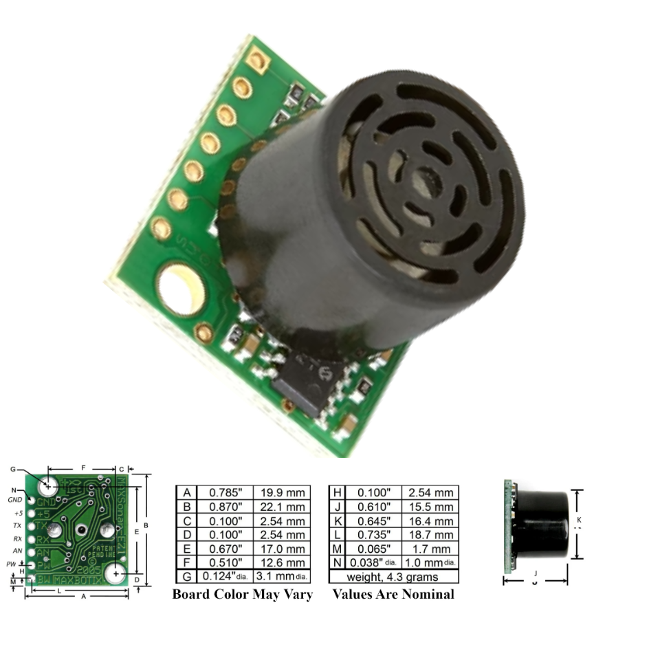
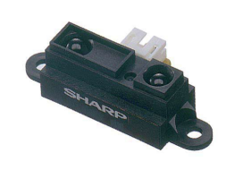
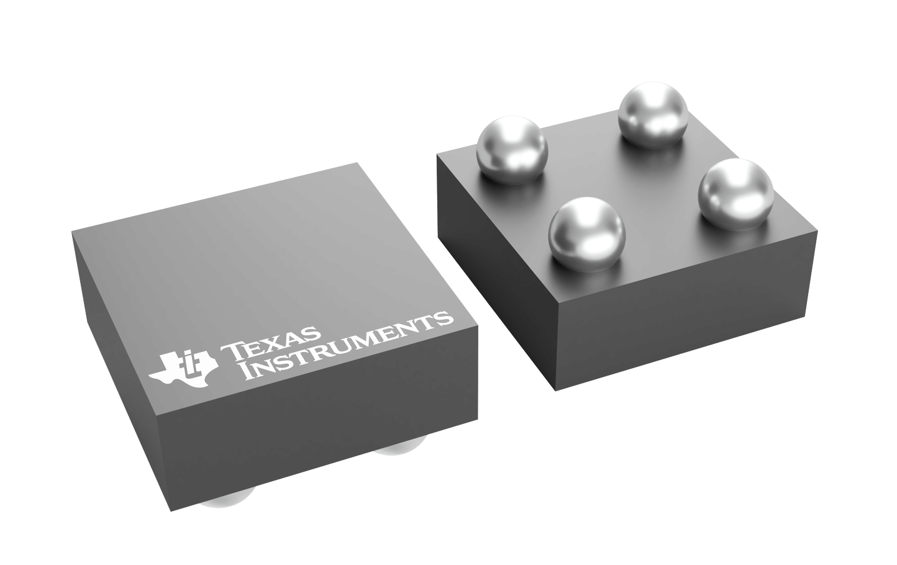
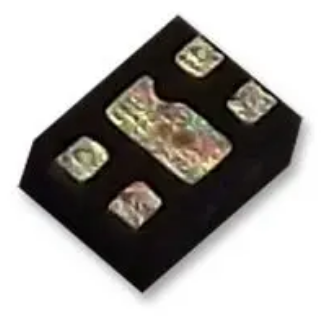

**Smart Trash Can \- Trash Height Subsystem**

**Height/Distance sensor**

| Solution | Pros  | Cons |
| ----- | ----- | ----- |
| **** Option 1 VL53L1X ToF sensor $3.5/each [Link to Product](https://www.futureelectronics.com/p/semiconductors--analog--sensors--time-off-flight-sensors/vl53l1cxv0fy-1-stmicroelectronics-3100441) | High accuracy with distance measurements up to 4 meters. Fast response time. Compact size, making it easy to integrate into various devices. Low power consumption. Inexpensive | Performance can be affected by ambient light conditions. Limited range compared to some other ToF sensors. Requires careful calibration for optimal accuracy. May struggle with reflective surfaces or dark materials. . |
| **** Option 2 MB1000 LV-MaxSonar-EZ0 $30/each [Link to Product](https://maxbotix.com/products/ultrasonic_sensors_mb1000) | High accuracy with a range of up to 6.45 meters. Wide detection angle. Low power consumption. Robust design, resistant to dust and moisture. Simple integration with various microcontrollers and systems. | Limited range in outdoor environments. Sensitivity to temperature changes can affect readings. Not suitable for detecting small objects. Expensive |
| **** Option 3 Sharp GP2Y0A21YK0F IR analog distance sensor $7.25/each [Link To Product](https://www.jameco.com/z/GP2Y0A21YK0F-Sharp-Electronic-Components-Sharp-IR-Distance-Sensor-GP2Y0A21YK0F-_2150256.html?CID=digipart) | Easy to interface with microcontrollers. Fast update rate for quick detection. Compact size Decent Range | Anything closer than 10 cm won’t be reliably measured. High Power consumption. Output signal is noisy and non-linear. Lower accuracy at extremes / sensitivity to reflectance.  |

**Choice:** Time-of-Flight sensor (VL53L1X)  
**Rationale:** The VL53L1X Time-of-Flight sensor provides accurate distance measurements without needing any external circuitry. This is ideal for our smart trash can. It also communicates easily with the PSoC through I²C. It also draws only about 16 mA during operation and can be put into shutdown mode to save power which is important for a battery-powered design. It is small, reliable, and easy to integrate, making it the best choice for consistent trash-level detection.

**Load Switch for power control**

| Solution | Pros | Cons |
| ----- | ----- | ----- |
| **** Option 1 TI TPS22991 Load switch $0.081/each [Link to Product](https://www.ti.com/product/TPS22991/part-details/PTPS22991BRAAR) | Low on-resistance (minimizes power loss and heat generation.) Fast system responsiveness. Integrated protection features  Compact package size  Wide input voltage range. | Limited current handling Requires careful thermal management. May have limited availability in certain regions. Not suitable for applications requiring reverse current blocking. |
| **** Option 2 SIP32431DNP3-T1GE4 Power Load switch $0.53/each [Link to Product](https://www.newark.com/vishay/sip32431dnp3-t1ge4/power-load-switch-high-side-tdfn/dp/61AC1925?CMP=KNC-BUSA-GEN-NEW-SKU-Optmyzr-Semis-IC&msclkid=f69a3dd9c9d118ba558d552b22f67f25) | Very low operating current (typically 10 pA at 3.3V) and low shutdown leakage  Low on-resistance Compact package Wide input voltage range Slew rate turn-on: The switch turn-on time of 100 μs.  | No integrated protection. Lower continuous current. Fixed slew rate. Less robust than smart load switches. |
| **** Option 3 TPS22910A Load switch $0.224/each [Link to Product](https://www.ti.com/product/TPS22910A/part-details/TPS22910AYZVR) | Low on-resistance. Fast system responsiveness. Integrated protection features. Compact package size. Wide input voltage range.. | Limited output current capability Requires external components for complete functionality. Not suitable for high-frequency switching applications due to limited bandwidth. Slightly higher quiescent current compared to some alternatives.  |

**Choice:** TI TPS22910A Load Switch  
**Rationale:** It provides a low on-resistance of approximately 60 mΩ, which minimizes voltage drop and heat loss. It also includes integrated protection features and a wide 1.4 V–5.5 V input range, making it easy to power the 3.3 V sensor from a battery or USB source. While the package is small and slightly harder to solder, its fast response and efficiency make it the most practical choice for controlling power to the VL53L1X sensor.

