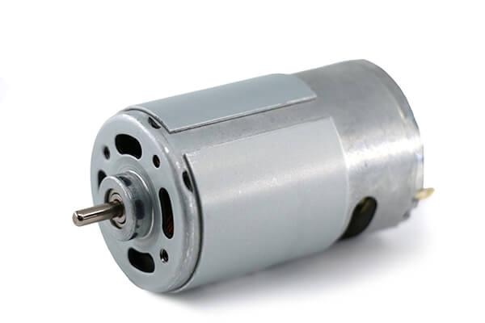
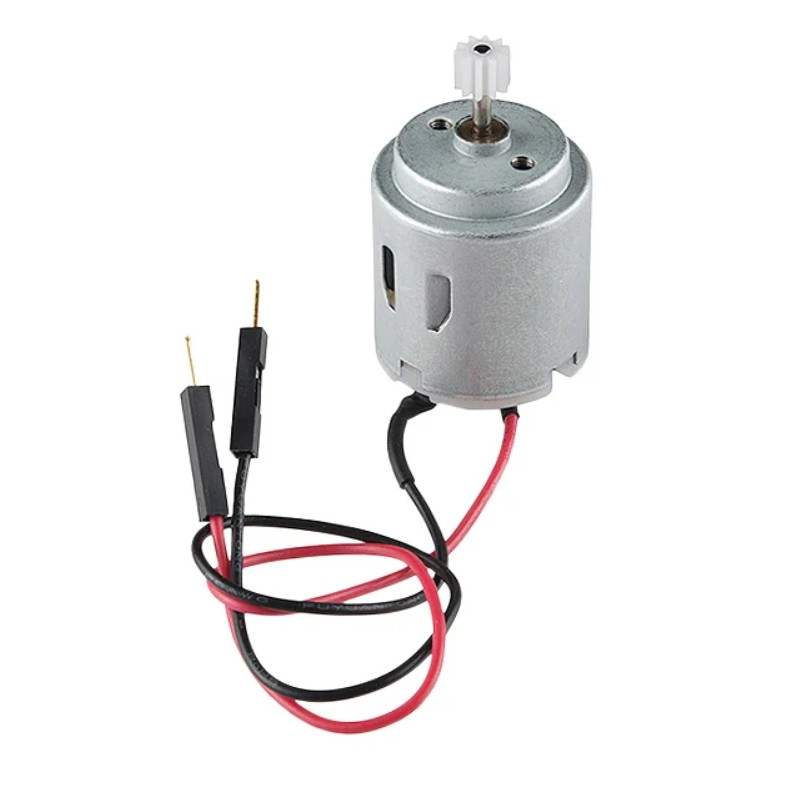
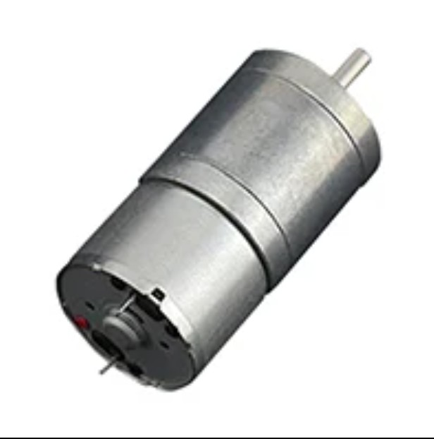
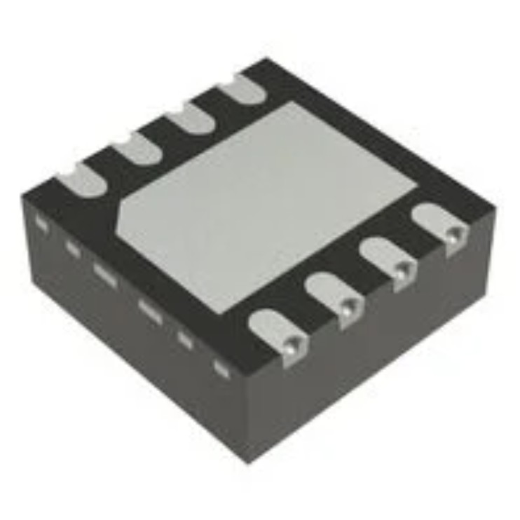

## Overview

The following are the components I have selected for my subsystem and the reason as to why I chose them.

**Motor**

| Solution | Pros  | Cons |
| ----- | ----- | ----- |
| **** Option 1  33JPF-15380-50 12V DC Motor   $20/each   [Link to Product](https://www.ebay.com/itm/355883040232) | High torque for its size.     controlled speed output.   Simple 2-wire DC operation.   I already have this.   Metal gearbox. | Noise.   Limited lifespan under heavy load.   low precision.|
| **** Option 2   ROB-11696 STANDARD MOTOR 12V   $2.75/each  [Link to Product](https://www.digikey.com/en/products/detail/sparkfun-electronics/11696/6163657) | Very low cost    Good no-load speed    Compact    High availability | Limited torque/power    No speed control    Noise, brush wear, and maintenance. |
| ****   Option 3   FIT0495-A 6V DC Motor   $10/each   [Link To Product](https://www.digikey.com/en/products/detail/dfrobot/FIT0495-A/7087178) | Simple and straightforward to use.   High torque.    Compact size    Decent Voltage Range | Very slow output speed    Limited to low-to-moderate workloads.    Low operating voltage. | 

**Choice:** 33JPF-15380-50 12V DC Motor 
**Rationale:** The OPB732 IR sensor is a simple and reliable option that’s easy to set up with the Curiosity Nano board. It doesn’t need extra parts to work and gives consistent distance readings for our project. It’s small, affordable, and well-known, which makes testing and integration quick and straightforward..

**H-Bridge** 

| Solution | Pros  | Cons |
| ----- | ----- | ----- |
| **** Option 1   FAN8100N   $1.16/each   [Link to Product](https://www.digikey.com/en/products/detail/onsemi/FAN8100N/966896?&msclkid=4365b6bb40ef1801d8acdfa0c82914a2&gclid=4365b6bb40ef1801d8acdfa0c82914a2&gclsrc=3p.ds&gad_source=7&gad_campaignid=21987644300) | Simplicity, easy to use    I already own one    Cheap | No longer manufactured    Lacks advanced features  |
| **** Option 2   NCV7703CD2R2G   $2.40/each   [Link to Product](https://www.digikey.com/en/products/detail/onsemi/NCV7703CD2R2G/7325621) | Flexible motor/bridge control    Protection features built-in.    Cost-effective    Widely available. | Limited continuous current capability.    Potential complexity in firmware/hardware integration. |
| **** Option 3   DRV8220DSGR   $0.88/each   [Link to Product](https://www.digikey.com/en/products/detail/texas-instruments/DRV8220DSGR/15295769) | Good output current for small / medium motors.    Low-power sleep mode.   Compact.   Wide voltage range. | Not for heavy-duty    Incompatible with PCB    Thermal / power dissipation constraints.  |

**Choice:** FAN8100N  
**Rationale:** The LM7805 is an easy-to-use and dependable voltage regulator that works well with the Curiosity Nano board. It gives a stable 5V output and only needs a couple of capacitors to set up. It’s inexpensive, widely available, and provides reliable power for the sensor and other parts of the circuit, making it a practical choice for this project.

