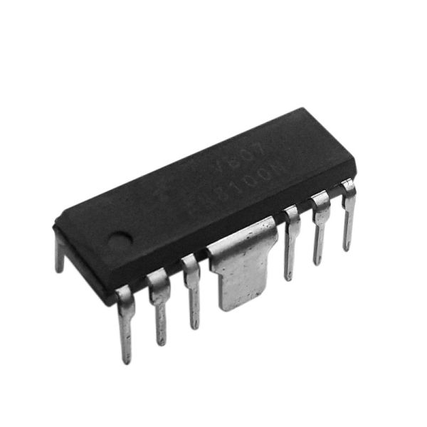

## Overview

The following are the components I have selected for my subsystem and the reason as to why I chose them.

**Motor**

| Solution | Pros  | Cons |
| ----- | ----- | ----- |
| **** Option 1  VL53L1X ToF sensor   $3.5/each   [Link to Product](https://www.futureelectronics.com/p/semiconductors--analog--sensors--time-off-flight-sensors/vl53l1cxv0fy-1-stmicroelectronics-3100441) | High accuracy with distance measurements up to 4 meters.    Fast response time.   Compact size, making it easy to integrate into various devices.   Low power consumption.   Inexpensive | Performance can be affected by ambient light conditions.   Limited range compared to some other ToF sensors.   Requires careful calibration for optimal accuracy.   May struggle with reflective surfaces or dark materials. |
| **** Option 2   OPB732 IR Sensor  $4/each  [Link to Product](https://www.onlinecomponents.com/en/productdetail/optek-technology-tt-electronics/opb732-51290988.html?msclkid=839b99712d5c180a0780f070a541179a&utm_source=bing&utm_medium=cpc&utm_campaign=Bing%20-%20Pmax%20-%20US%20-%20Low&utm_term=2332201602016770&utm_content=Other&gclid=839b99712d5c180a0780f070a541179a&gclsrc=3p.ds&gad_source=7&gad_campaignid=23052854090) | Known component and setup    Not too expensive    Compact    High availability | Limited range    No modern features    Interference sensitivity |
| ****   Option 3   Sharp GP2Y0A21YK0F IR analog distance sensor   $7.25/each   [Link To Product](https://www.jameco.com/z/GP2Y0A21YK0F-Sharp-Electronic-Components-Sharp-IR-Distance-Sensor-GP2Y0A21YK0F-_2150256.html?CID=digipart) | Easy to interface with microcontrollers.   Fast update rate for quick detection.   Compact size    Decent Range | Anything closer than 10 cm won’t be reliably measured.    High Power consumption.    Output signal is noisy and non-linear.   Lower accuracy at extremes    sensitivity to reflectance. | 

**Choice:** OPB732 IR Sensor  
**Rationale:** The OPB732 IR sensor is a simple and reliable option that’s easy to set up with the Curiosity Nano board. It doesn’t need extra parts to work and gives consistent distance readings for our project. It’s small, affordable, and well-known, which makes testing and integration quick and straightforward..

**H-Bridge** 

| Solution | Pros | Cons |
| ----- | ----- | ----- |
| **** Option 1   FAN8100N   $1.16/each   [Link to Product](https://www.digikey.com/en/products/detail/onsemi/FAN8100N/966896?&msclkid=4365b6bb40ef1801d8acdfa0c82914a2&gclid=4365b6bb40ef1801d8acdfa0c82914a2&gclsrc=3p.ds&gad_source=7&gad_campaignid=21987644300) | Simplicity, easy to use    I already own one    Cheap | No longer manufactured    Lacks advanced features  |
| **** Option 2   AMS1117-5.0   $0.5/each   [Link to Product](https://www.digikey.com/en/products/detail/evvo/AMS1117-5-0/24370130) | Low Dropout Voltage    Widely Available    Compact package    Built-in Protections | Thermal Issues    Fixed Output   Sensitive to Capacitor Choice |
| **** Option 3   LM2596   $2/each   [Link to Product](https://www.ti.com/lit/ds/symlink/lm2596.pdf) | Adjustable Output    Wide Input Voltage Range.   Integrated protection features.   Stable Output | Complex design    Generates electrical noise   Larger Circuit Footprint   |

**Choice:** LM7805  
**Rationale:** The LM7805 is an easy-to-use and dependable voltage regulator that works well with the Curiosity Nano board. It gives a stable 5V output and only needs a couple of capacitors to set up. It’s inexpensive, widely available, and provides reliable power for the sensor and other parts of the circuit, making it a practical choice for this project.

