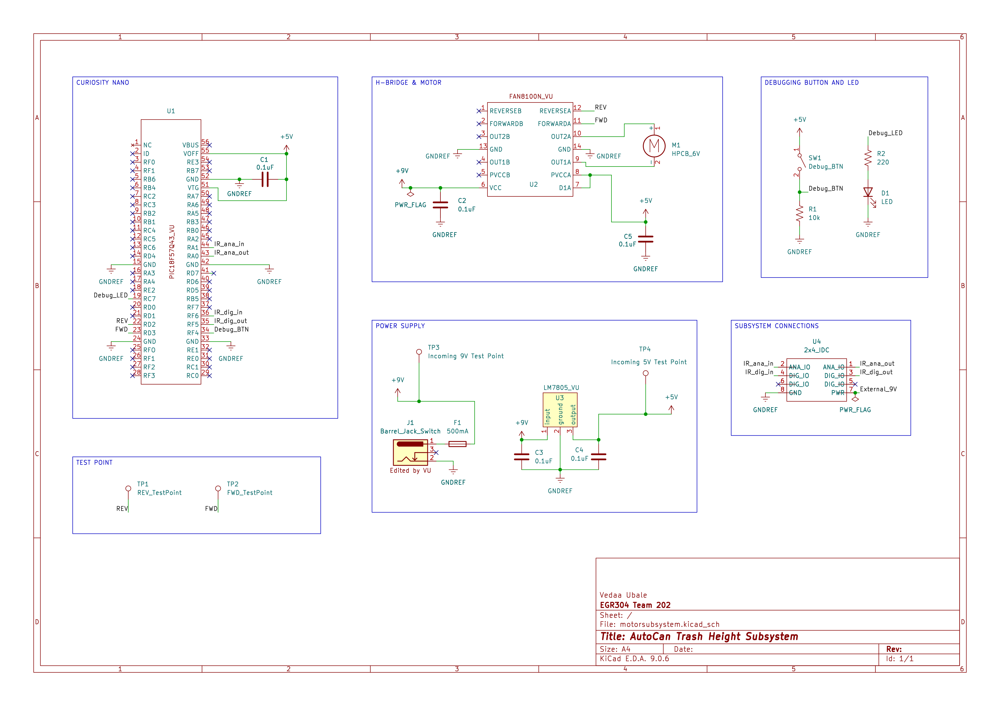

## Overview

This schematic is primarily designed to support the Lid Control Subsystem of the AutoCan. This subsystem interfaces with the IR Sensor Subsystem, which detects the presence of a user near the trash can. Upon receiving this signal, the Lid Control Subsystem utilizes an H-bridge motor driver circuit to control the direction and motion of the lid’s motor, enabling automatic opening and closing. This design ensures efficient, hands-free operation and responsive user interaction.

{style width:"350" height:"300;"}

## Resouces

The schematic as a PDF download is available [*here*](motorsubsystemschematic.pdf), and the Zip folder of the project [*here*](schematicvuFINAL.zip).
