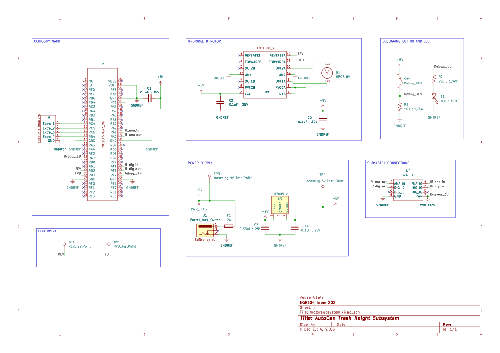

## Overview

This schematic is primarily designed to support the Lid Control Subsystem of the AutoCan. 

The schematic shows a complete motor-control subsystem built around the PIC18F57Q43 microcontroller, an H bridge motor driver, and a stable power path. The system begins with a 9 volt power supply that feeds both the motor and a 7805 voltage regulator. The regulator steps the voltage down to 5 volts, which powers the PIC, the debug LED, the test button, and the connector that receives signals from the IR subsystem. Placing the regulator between the supply and the logic components ensures that the microcontroller and sensors always receive a clean and stable voltage.

The PIC serves as the control center. Two of its output pins are dedicated to the forward and reverse signals that go into the FAN8100N H bridge. These outputs determine the direction of the motor by switching the polarity across the motor terminals. When the PIC drives one pin high and the other low, the lid opens or closes accordingly. The PIC also receives an input signal from the IR subsystem through the connector. This input tells the microcontroller when a user’s hand is detected so it can command the lid to open. In addition, a test button is wired as a digital input so manual control is available for debugging or override. A debug LED is connected as a digital output that provides simple visual feedback during operation or testing.

The H bridge is the interface between the PIC and the motor. It receives the forward and reverse logic signals from the microcontroller and uses them to drive the 12 volt motor with the necessary polarity and current. This allows the motor to open and close the lid on command. The motor is powered directly from the 9 volt supply so it has sufficient current for movement, while the logic side stays isolated on the 5 volt rail. Together, these components form a complete subsystem capable of controlled bidirectional motor movement, sensor-based activation, manual testing, and stable power distribution.

{style width:"350" height:"300;"}

## Resouces

The schematic as a PDF download is available [*here*](motorsubsystemSCH.pdf), and the Zip folder of the project [*here*](motorsubsystemfinal.zip).
