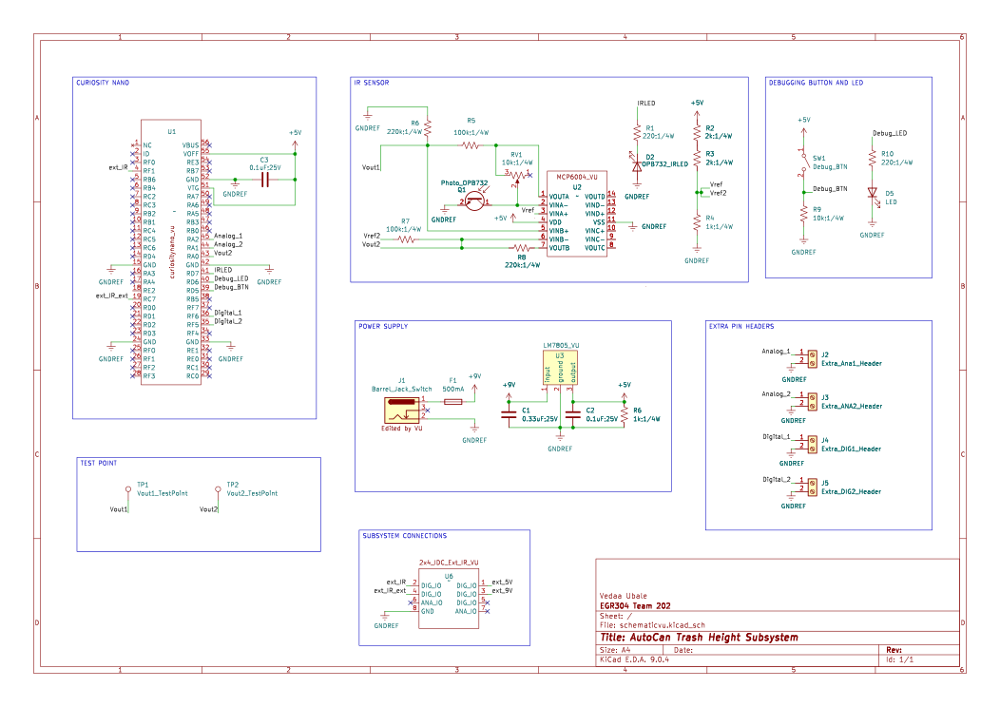

## Overview

This schematic is primarily designed to support the Trash Height Subsystem of the AutoCan. This subsystem uses an IR sensor to detect when the trash has reached a critical height and sends a signal to the External IR Sensor and UI Lights subsystem. The signal triggers the front-facing LED to inform the user that the trash is full and needs to be emptied.

{style width:"350" height:"300;"}

## Resouces

The schematic as a PDF download is available [*here*](schematicvuFINAL.pdf), and the Zip folder of the project [*here*](schematicvu.zip).
