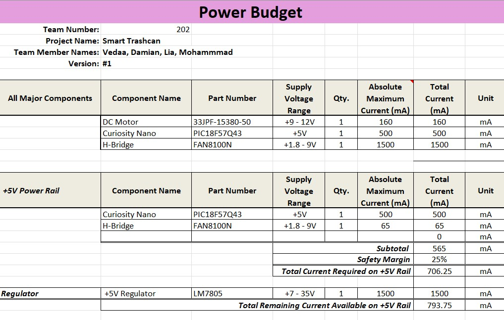
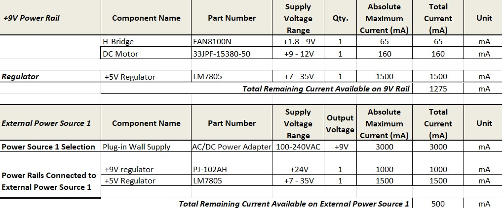

## Overview
Here is the the power budget for my Lid motor subsystem. I have calculated and listed the power draw of all the major components in order to decide whether my power supply will be enough to handle everything and what value fuse I should use.

 
 
The power budget as a PDF download is available [*here*](PowerBudgetVedaamotor1.pdf), and a Microsoft Excel Sheet [*here*](PowerBudgetVedaamotor1.xlsx).
