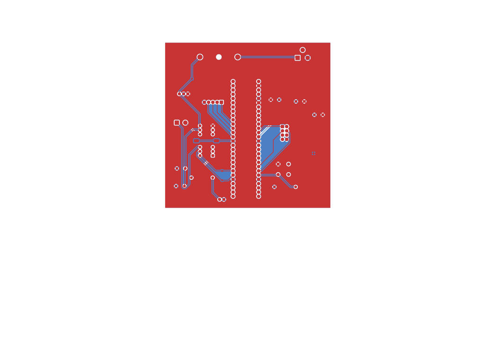
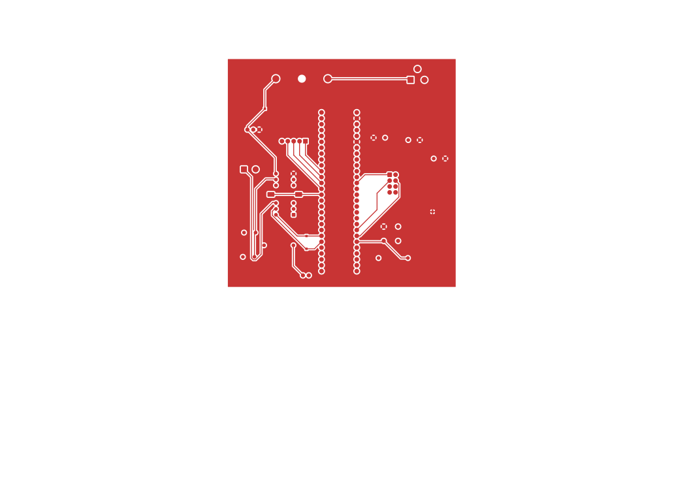
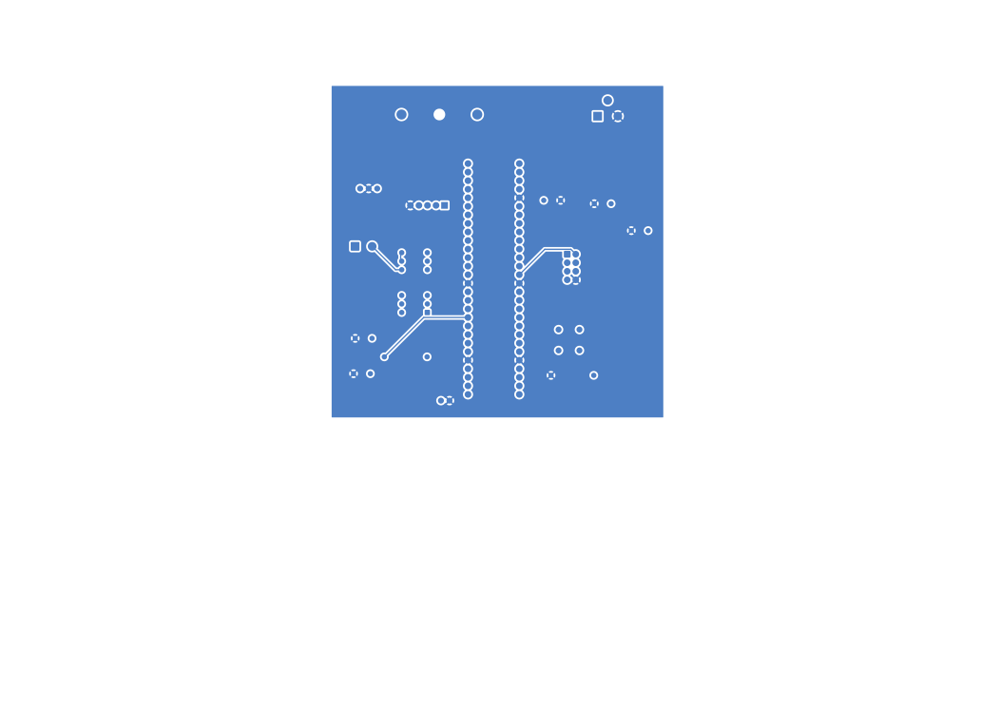
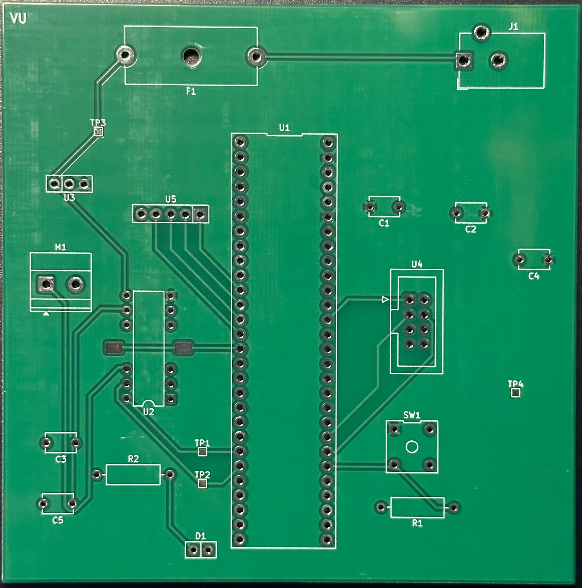
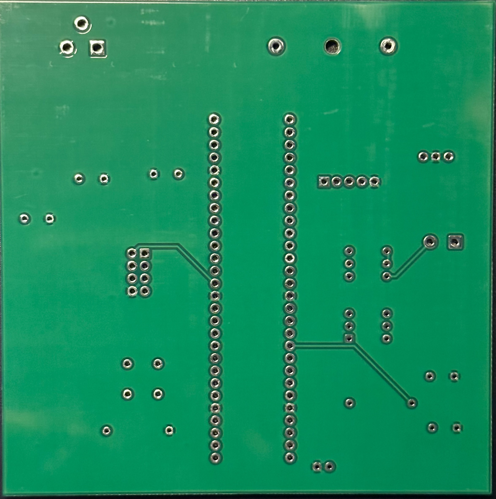

## Overview

This section contains the PCB (Printed Circuit Board) design for the AutoCan project. The PCB integrates the components from the schematic into a physical board layout that can be manufactured and assembled. On my PCB, I organized all of the major parts of the motor subsystem so that power, control, and motor signals flow cleanly across the board. The barrel jack and fuse are placed near the top edge so the incoming 9 volt supply enters the board safely and immediately passes through protection before reaching anything else. From there, the power traces split so the motor receives the full 9 volts while the LM7805 regulator creates the 5 volt rail for the microcontroller and other low voltage parts. I placed decoupling capacitors close to the regulator and H bridge to keep the power stable and reduce noise from the motor.

The PIC18F57Q43 Curiosity Nano sits at the center of the PCB, acting as the main controller for the system. I routed the forward and reverse control traces from the PIC directly to the FAN8100N H bridge to keep those signals short and clear. The H bridge and motor connector are located on the left side of the board so the high current motor paths stay grouped together and away from the sensitive logic traces. This helps reduce electrical noise and keeps the board easier to debug.

On the right side, I placed the connector for the IR subsystem along with the debug button and LED. Keeping the debug interface close to the PIC helps maintain signal integrity and gives me easy access for troubleshooting. I also added two test points near the H bridge so I can quickly check the forward and reverse signals with a multimeter or oscilloscope. Overall, I arranged the PCB so that power flows from the top, high current stays isolated, and external connections are easy to reach. This layout makes the board cleaner, safer, and much easier to work with during testing and assembly.

## PCB Layout

Figure 01: Both layers of PCB Design.
{style width:"350" height:"300;"}

Figure 02: Top layer of PCB Design.
{style width:"350" height:"300;"}

Figure 03: Back layer of PCB Design.
{style width:"350" height:"300;"}

## Final PCB

Our team did not receive the PCBs in time to solder and test them. However, these are pictures of the front and back view of the raw PCB:

Front view:
{style width:"350" height:"300;"}

Back view:
{style width:"350" height:"300;"}

The Front PCB design as a PDF download is available [*here*](motorsubsystem-F_Cufinal.pdf).  
The Back PCB design as a PDF download is available [*here*](motorsubsystem-B_Cufinal.pdf).  
The Zip folder of the project is available [*here*](motorsubsystemfinal.zip).  
The Zip folder of the Gerber and drill files are [*here*](motorpcbgerberdrill.zip).
