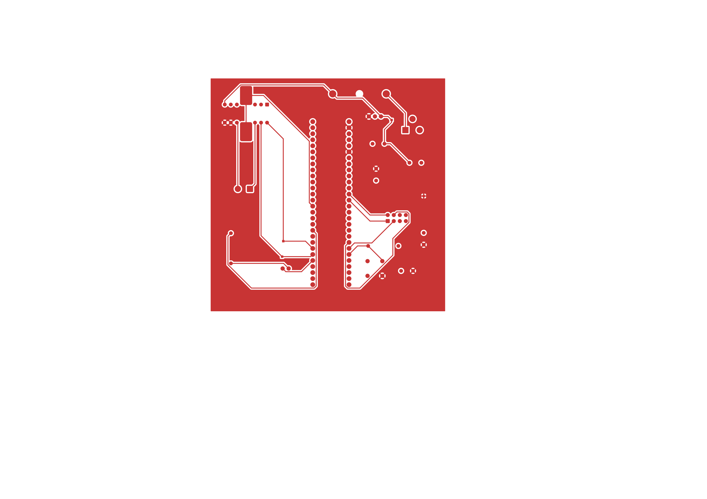
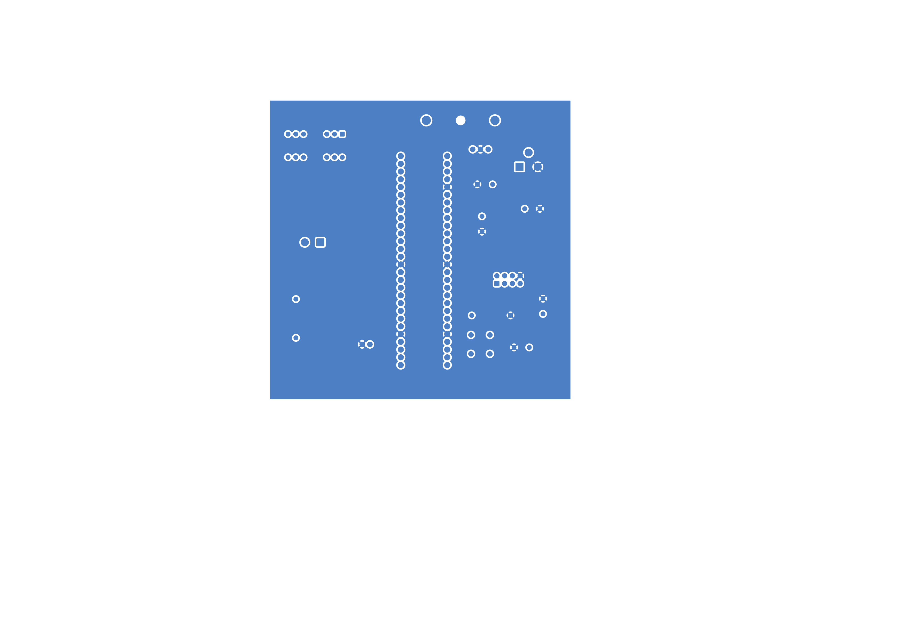

## Overview

This section contains the PCB (Printed Circuit Board) design for the AutoCan project. The PCB integrates the components from the schematic into a physical board layout that can be manufactured and assembled.

## PCB Layout

Figure 01: Showing Vedaa's Front PCB Design.
{style width:"350" height:"300;"}

Figure 02: Showing Vedaa Ubale's Back PCB Design.
{style width:"350" height:"300;"}

The Front PCB design as a PDF download is available [*here*](motorsubsystem-F_Cu.pdf).  
The Back PCB design as a PDF download is available [*here*](motorsubsystem-B_Cu.pdf).  
The Zip folder of the project is available [*here*](motorsubsystemvedaaubale.zip).  
The Zip folder of the Gerber and drill files are [*here*](motorsubsystemgerberdrl.zip).
